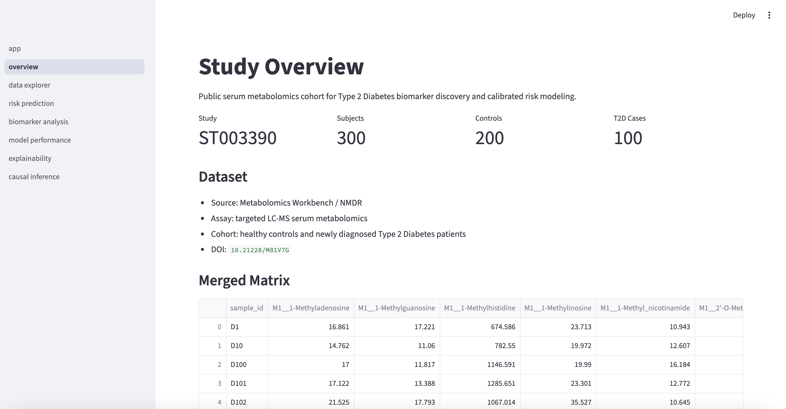
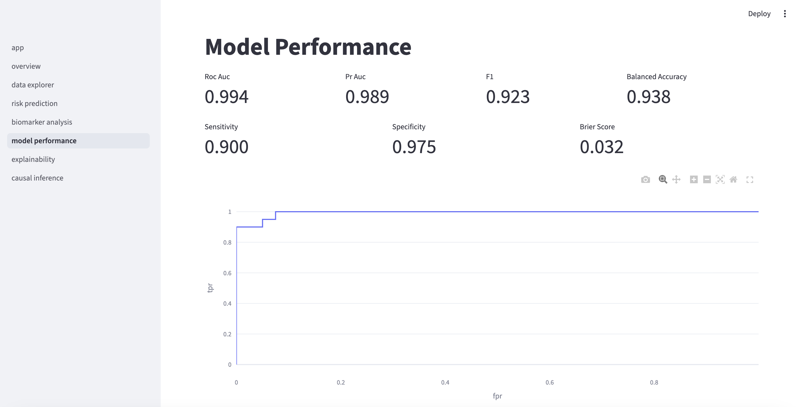
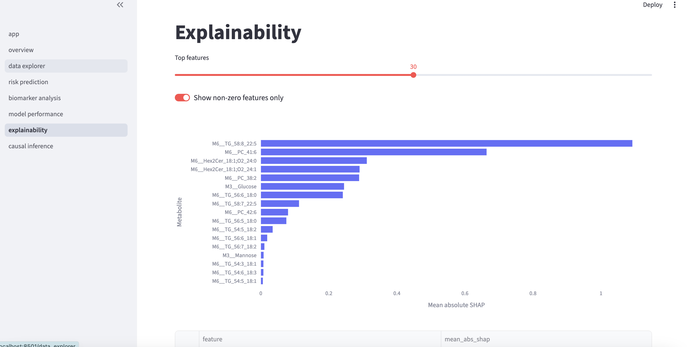
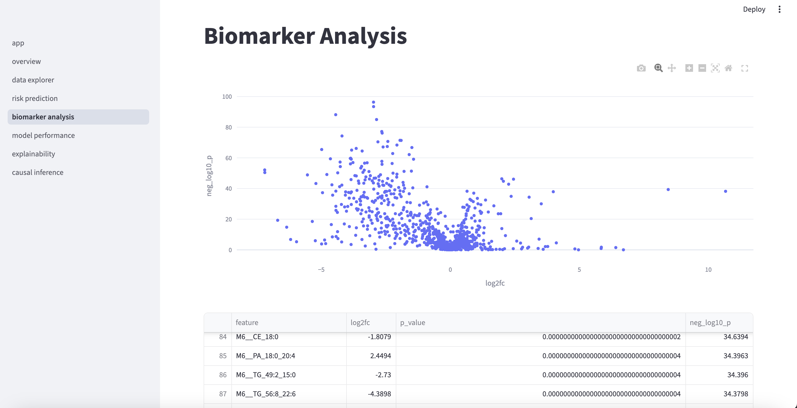
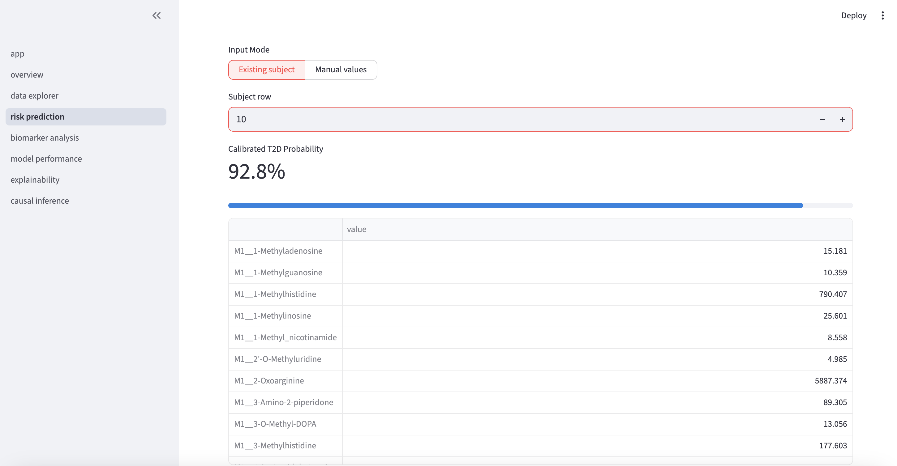

# Predictive Modeling of Cardiometabolic Disease Using Serum Metabolomics

An end-to-end biomedical machine learning project for Type 2 Diabetes status prediction, biomarker discovery, model calibration, explainability, and exploratory causal association analysis using public serum metabolomics data.

The project demonstrates a reproducible research workflow: automated data ingestion, leakage-aware preprocessing, fold-contained feature selection, Optuna-tuned XGBoost modeling, calibrated prediction, SHAP explainability, biomarker ranking, and an interactive Streamlit dashboard.

## Highlights

- Public metabolomics dataset from Metabolomics Workbench study `ST003390`
- 300 serum samples: 200 healthy controls and 100 newly diagnosed T2D patients
- Targeted LC-MS metabolomics feature matrices
- Stratified train/test evaluation with calibrated risk prediction
- Feature selection inside sklearn pipelines to reduce leakage risk
- SHAP and XGBoost feature-importance outputs
- Train-only biomarker discovery plus held-out validation tables
- Streamlit dashboard for data exploration, prediction, biomarkers, performance, explainability, and exploratory causal association

## Key Results

Latest default training run:

| Metric | Value |
| --- | ---: |
| ROC-AUC | 0.9938 |
| PR-AUC | 0.9887 |
| F1-score | 0.9231 |
| Sensitivity | 0.9000 |
| Specificity | 0.9750 |
| Balanced accuracy | 0.9375 |
| Brier score | 0.0315 |

These metrics are generated from an internal stratified holdout split. See [Model Scope and Validation Notes](#model-scope-and-validation-notes) for interpretation.

## Dataset

- Source: Metabolomics Workbench / National Metabolomics Data Repository
- Study ID: `ST003390`
- DOI: `10.21228/M81V7G`
- Title: In-depth profiling of biosignatures for Type 2 diabetes mellitus cohort utilizing an integrated targeted LC-MS platform
- Design: observational serum targeted LC-MS cohort
- Subjects: 300 total, 200 healthy controls, 100 newly diagnosed T2D patients

Study page: https://metabolomicsworkbench.org/data/DRCCMetadata.php?DataMode=CollectionData&Mode=Study&ResultType=1&StudyID=ST003390&StudyType=MS

## Project Structure

```text
data/
  raw/                    # downloaded Workbench files, ignored by git
  processed/              # merged matrices and train/test splits, ignored by git
notebooks/                # exploratory analysis notes
src/
  preprocessing.py        # loading, matrix parsing, preprocessing transformers
  feature_engineering.py  # optional engineered clinical/metabolite features
  feature_selection.py    # ANOVA, mutual information, L1 logistic selection
  modeling.py             # training CLI, baselines, Optuna, calibration
  evaluation.py           # ROC-AUC, PR-AUC, F1, sensitivity, specificity, Brier
  explainability.py       # feature importance and SHAP artifact generation
  causal_inference.py     # exploratory IPW association estimate
  visualization.py        # Plotly charts and biomarker visualizations
  utils.py                # downloader and file utilities
models/                   # generated model artifacts, ignored by git
figures/                  # generated figures, ignored by git
results/                  # generated metrics/tables, ignored by git
streamlit_app/
  app.py                  # dashboard home
  pages/                  # Streamlit multipage views
```

## Installation

```bash
git clone https://github.com/<your-username>/cardiometabolic-disease-metabolomics-ml.git
cd cardiometabolic-disease-metabolomics-ml

python3 -m venv .venv
source .venv/bin/activate
pip install -r requirements.txt
```

## Data Download

Download the processed Metabolomics Workbench study files:

```bash
python -m src.utils download
```

The repository intentionally does not commit raw or processed data files. They are generated locally under:

```text
data/raw/
data/processed/
```

If the Workbench page layout changes, manually place the six `MSdata_ST003390_*.txt` matrices in `data/raw/`, then run training.

## Train The Model

Fast reproducible training:

```bash
python -m src.modeling --trials 5 --seed 42 --n-jobs 1
```

More thorough tuning on a stronger machine:

```bash
python -m src.modeling --trials 30 --seed 42 --n-jobs 4
```

Skip exploratory causal association export:

```bash
python -m src.modeling --trials 5 --seed 42 --n-jobs 1 --skip-causal
```

Available training options:

```bash
python -m src.modeling --help
```

## Generated Outputs

Training creates local artifacts that are ignored by git:

```text
models/
  elastic_net_logistic.joblib
  random_forest.joblib
  xgboost_calibrated.joblib
  xgboost_uncalibrated_pipeline.joblib
  shap_explainer.joblib

results/
  test_metrics.json
  all_model_metrics.json
  selected_biomarkers.csv
  feature_importance.csv
  shap_feature_ranking.csv
  train_ranked_biomarkers.csv
  test_validation_biomarkers.csv
  ranked_biomarkers.csv
  roc_curve.csv
  pr_curve.csv
  calibration_curve.csv
  causal_association.json
```

## Streamlit Dashboard

Launch the dashboard:

```bash
source .venv/bin/activate
python -m streamlit run streamlit_app/app.py
```

Dashboard pages:

- Overview
- Data Explorer
- Risk Prediction
- Biomarker Analysis
- Model Performance
- Explainability
- Causal Inference

## Dashboard Preview

### Study Overview



### Model Performance



### Explainability



### Biomarker Analysis



### Risk Prediction



## Modeling Workflow

1. Load and merge ST003390 metabolomics matrices by sample ID.
2. Validate class labels and cohort dimensions.
3. Stratified 80/20 train-test split.
4. Apply fold-contained preprocessing:
   - missingness filtering
   - median imputation
   - clipped `log1p` transformation
   - standardization
5. Apply fold-contained feature selection:
   - ANOVA F-test
   - mutual information
   - L1 logistic regression
6. Train baseline models:
   - Elastic Net Logistic Regression
   - Random Forest
7. Tune XGBoost with Optuna.
8. Calibrate the final classifier.
9. Export evaluation metrics, ROC/PR/calibration curves, selected biomarkers, SHAP ranking, and biomarker discovery tables.

## Model Scope and Validation Notes

This project is intended as a research-grade machine learning demonstration using a public metabolomics cohort.

- Performance is evaluated with an internal stratified holdout split. External validation would be required before claims about generalization to other cohorts, laboratories, assay platforms, or clinical populations.
- Biomarker rankings are hypothesis-generating. The pipeline exports train-only discovery and held-out validation tables, but findings still require independent validation, multiple-testing review, and biological interpretation.
- Causal and IPW outputs are exploratory association analyses. Causal interpretation would require a defensible causal graph, baseline confounders, overlap diagnostics, covariate balance checks, and sensitivity analyses.
- Batch effects or cohort-specific signals may contribute to high performance. Additional metadata would be needed to fully assess run order, sample handling, and assay batch confounding.
- Serialized `.joblib` files are intended for trusted local artifacts only. Do not load untrusted pickle/joblib files.

## Reproduce Results

Generated data, model artifacts, figures, and result files are excluded by `.gitignore` to keep the repository lightweight. The full workflow can be reproduced from the public Metabolomics Workbench source.

End-to-end reproduction:

```bash
python3 -m venv .venv
source .venv/bin/activate
pip install -r requirements.txt
python -m src.utils download
python -m src.modeling --trials 5 --seed 42 --n-jobs 1
python -m streamlit run streamlit_app/app.py
```

The repository includes placeholder `.gitkeep` files so the expected output directories are visible without committing generated artifacts.
